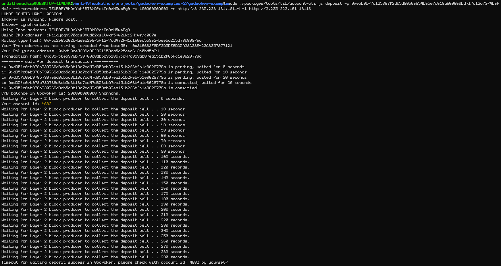
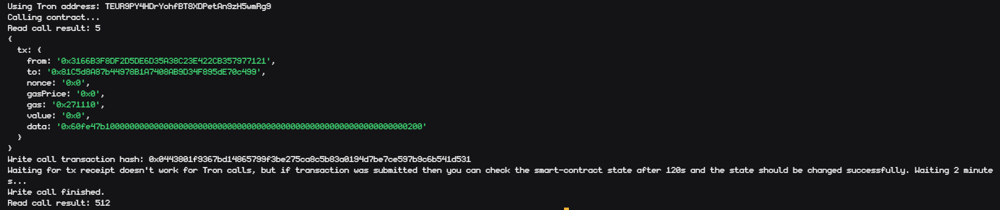

# Nervos11
Use A Tron Wallet To Execute A Smart Contract Call

# Account list


# Layer 1 address
https://explorer.nervos.org/aggron/address/ckt1qyqqm370acs9nud02ksllwkn5vw2wkc24xwsjc067e

# CKByte deposit to tron address on layer 2


# Issuing smart contract calls


# Transaction hash
```sh
0x0443801f9367bd14865799f3be275ca8c5b83a0194d7be7ce597b9c6b541d531
```

# Contract Address
```sh
0x81C5d8A87b44978B1A7408AB9D34F895dE70c499
```

# Contract ABI
```json
[
    {
      "inputs": [],
      "stateMutability": "payable",
      "type": "constructor"
    },
    {
      "inputs": [
        {
          "internalType": "uint256",
          "name": "x",
          "type": "uint256"
        }
      ],
      "name": "set",
      "outputs": [],
      "stateMutability": "payable",
      "type": "function"
    },
    {
      "inputs": [],
      "name": "get",
      "outputs": [
        {
          "internalType": "uint256",
          "name": "",
          "type": "uint256"
        }
      ],
      "stateMutability": "view",
      "type": "function"
    }
]
```

# Tron Address
```sh
TEUR9PY4HDrYohfBT8XDPetAn9zH5wmRg9
```