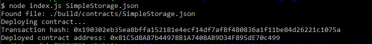

# Nervos02

# Screenshot of the console output after deploying the smart contract


# Transaction hash
```sh
0x190302eb35ea8bffa152181e4ecf14df7af8f480836a1f11be84d26221c1075a
```

# Contract Address
```sh
0x81C5d8A87b44978B1A7408AB9D34F895dE70c499
```