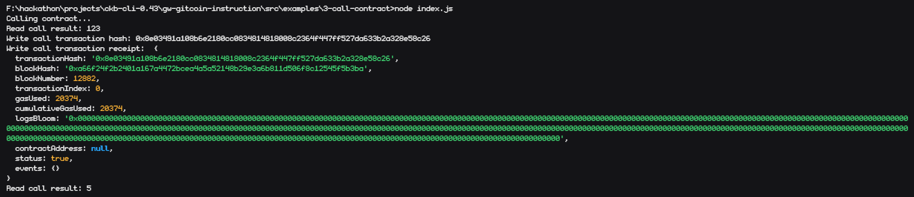

# Nervos03

# Screenshot of the console output after calling the smart contract


# Transaction hash
```sh
0x8e03491a108b6e2180cc0834814818008c2364f447ff527da633b2a328e58c26
```

# Contract Address
```sh
0x81C5d8A87b44978B1A7408AB9D34F895dE70c499
```

# Contract ABI
```json
[
    {
      "inputs": [],
      "stateMutability": "payable",
      "type": "constructor"
    },
    {
      "inputs": [
        {
          "internalType": "uint256",
          "name": "x",
          "type": "uint256"
        }
      ],
      "name": "set",
      "outputs": [],
      "stateMutability": "payable",
      "type": "function"
    },
    {
      "inputs": [],
      "name": "get",
      "outputs": [
        {
          "internalType": "uint256",
          "name": "",
          "type": "uint256"
        }
      ],
      "stateMutability": "view",
      "type": "function"
    }
]
```