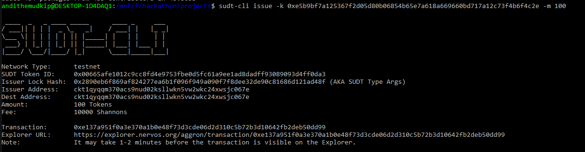
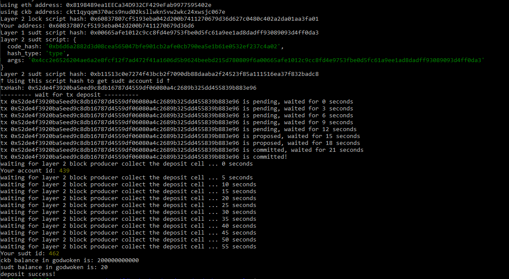

# Nervos04

# Layer 1 address on the testnet explorer

https://explorer.nervos.org/aggron/address/ckt1qyqqm370acs9nud02ksllwkn5vw2wkc24xwsjc067e

# Screenshot of the console output after using sudt-cli to create SUDT tokens on layer 1



# Link to the transaction on the testnet explorer

https://explorer.nervos.org/aggron/transaction/0xe137a951f0a3e370a1b0e48f73d3cde06d2d310c5b72b3d10642fb2deb50dd99

# Screenshot of the console output after submitting a deposit to Layer 2



# SUDT ID

```sh
462
```