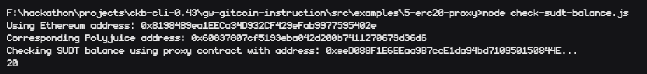

# Nervos05

# Screenshot of the console output after deploying the smart contract


# Address of the ERC20 Proxy Contract
```sh
0xeeD088F1E6EEaa9B7ccE1da94bd710950150844E
```

# Screenshot of the console output after checking SUDT balance


# The Ethereum address that was checked
```sh
0x8198489ea1EECa34D932CF429eFab9977595402e
```