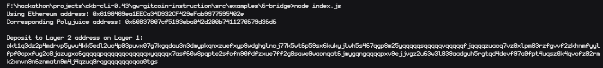

# Nervos06

# Screenshot of the console output after generating the Deposit Receiver Address



# Deposit Receiver Address

```sh
ckt1q3dz2p4mdrvp5ywu4kk5edl2uc4p03puvx07g7kgqdau3n3dmypkqnxzuefxyp9wdghglncj77k5wt6p59sx6kukyjlwh5s467qgp8m25yqqqqqsqqqqqvqqqqqfjqqqqzuacq7vz0xlpm83rzfgvvf2zkhnmfyylfpf0cpxfug2c8jazugxc6gqqqqpqqqqqqcqqqqqxyqqqqx7asf60w8pqpte2sfcfn90fdfzxue7ff2g8sawe9wacnqat6jmygqngqqqqpxv9ejjvgz2u63w3l839aadguh5rgtqd4devf97a0fpt4uqsz0k4qvcfz02rmk2xnvn9n6znmatn9m4j4qzuq9rqgqqqqqqcqaa0tgs
```

# Ethereum Address used to generate the Deposit Receiver Address

```sh
0x8198489ea1EECa34D932CF429eFab9977595402e
```

# Link to the etherscan explorer for the successful Force Bridge transaction.

https://rinkeby.etherscan.io/tx/0xdd61f1f506ad1d080bb056729ae5f9f2f7cb140e718c3a8e3c80335fed1dca17

# Link to the Nervos explorer for the successful Force Bridge transaction

https://explorer.nervos.org/aggron/transaction/0x86d2efa1b7d73ddae1ebc4cc119f79ad20b8adbbce3e7e918ee96879f65089ac