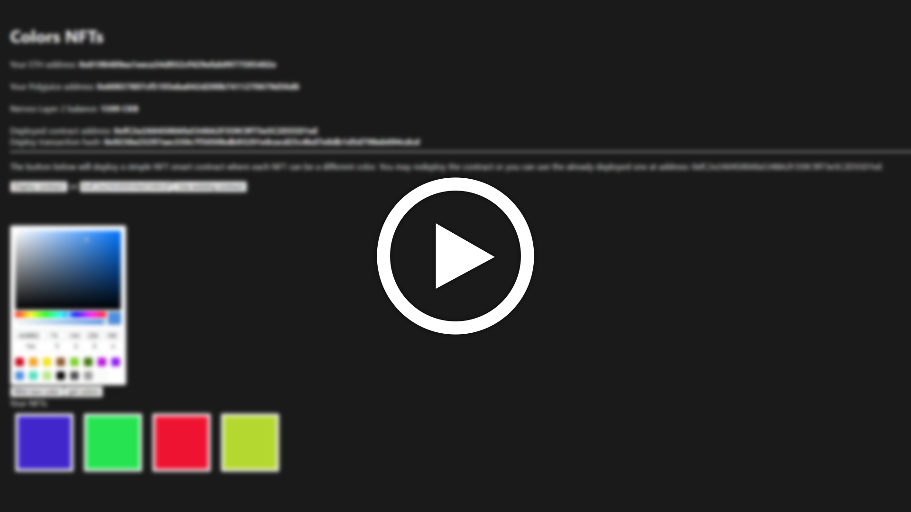

# Nervos08
Adding Force Bridge support in the dApp from task 7
# Video
[](https://www.youtube.com/watch?v=CrQZBO92uZ4 "Force Bridge support in dApp")
# Address of SUDT-ERC20 Proxy Contract
```sh
0xC50F24B107052687FF2b46da6D5aB6cE682377a6
```

# Github repository of application
https://github.com/andithemudkip/simple-nft